### 代码使用
- data文件夹<br>
    - mchar文件夹<br>
    mchar文件夹用来存放数据集，数据集从天池官网进行下载。
    - dataset.py<br>
    继承data.DataSet，构建适合SVHN数据集的类SVHMDataset。
- mode文件夹<br>
    - basic_model.py<br>
    构建神经网络模型，在ResNet18或ResNet34后面并联4个全连接层用于分类。<br>
    也可以构建自己的模型或使用更复杂的模型。
- main.py<br>
    - train_val()<br>
    训练和验证
    ```python
    python main.py train_val
    ```
    - test_submit()<br>
    测试和提交
    ```python
    python main.py test_submit --path = 'checkpoints/...'
    ```
- utils<br>
用于存放各种工具函数。
- checkpoints<br>
用于存放训练的模型。


### 实践总结
这次实践是天池上的一个字符识别比赛mchar，数据集使用的是Google街景图像门牌号数据集SVHM，任务是识别不定长街景门牌字符。  

解决这个问题的思路可以有多种。一是当作**图像分类**问题，首先固定字符的长度，然后在CNN后添加多个全连接分支进行多字符分类，按顺序把多个分支的结果连接，作为最终的结果输出。二是当作**目标检测**问题，首先检测出每张图片中的多个字符，然后按顺序把字符连接起来，作为最终的结果输出。  

master分支中实现的是图像分类的解决思路，SSD分支中实现的是SSD目标检测的解决思路。

### baseline图像分类
这个比赛给了一个baseline基础代码，格式是jupyter notebook。我把整个代码改为了pycharm工程的格式。<br>
整体提交的结果如下：    
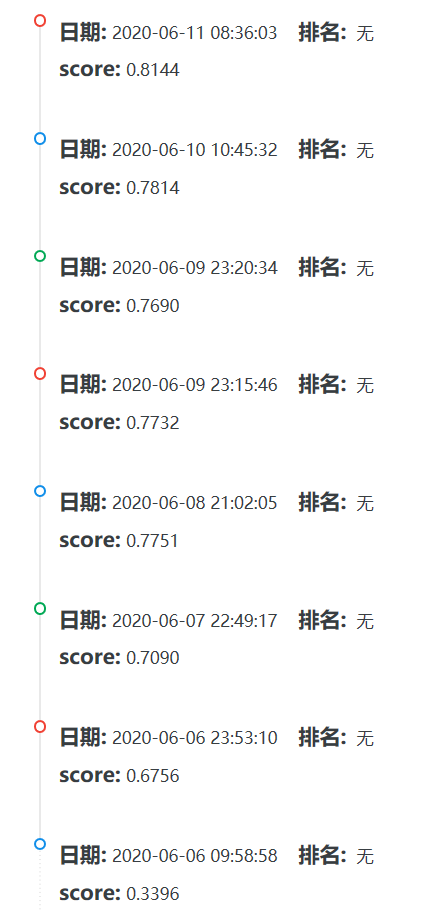

第一次按照baseline进行训练，batch_size=40，epoch=10，提交的结果是score=0.3396，是比较低的。<br>
我们发现baseline中训练集和验证集图片的处理是resize成(64,128)，然后随机裁剪为(60,120)。但是测试集图片处理是resize为(70,140)。<br>
由于训练模型适应的图片尺寸和测试集输入的图片尺寸不符，尺寸偏差不大，但是了超过10%，而我们这个任务对于字符位置是很敏感的，造成最终测试集得分比较低。修改这个baseline中的bug后，后续的测试集得分就比较高了。
### ResNet18 学习率调节
baseline中使用的是Pytorch中ResNet18的预训练模型。我们就在这个模型上进行调节。
- **一阶学习率**
    - **lr = 0.01**<br>
      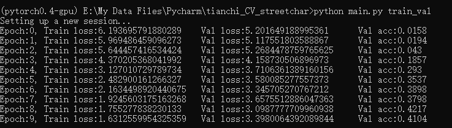<br>
      我们整个基于图片分类的解决方案中使用的优化器都是Adam。<br>
      首先以0.01的学习率训练了10个epoch，我们发现起始的val_loss没有快速的下降，val_acc没有快速提高，都处于波动。说明初始初始学习率0.01不合适。<br>
      尽管初始学习率设置为0.01不合适，但是我们还是看到在10个epoch后，val_acc提高到0.4104，见证了**Adam优化器的强大**。Adam优化器兼具AdaDelta和动量的优点。AdaDelta优化器的学习率是随时间和参数变化的，从而减少了手动调节学习率，所以Adam在初始学习率0.01不合适的情况下，在自适应调节了3个epoch后，我们看到val_acc的快速上升。由于加入了动量项，所以Adam优化器可以加速收敛，减小振荡。  

    - **lr = 0.001**<br>
    <br>
    这是以0.001作为初始学习率训练15个epoch的结果。我们看到开始的val_loss在快速下降，val_acc在快速上升，8个epoch之后就将val_acc提高到0.5612。说明**0.001的初始学习率是合适的**。<br>
    第9个epoch到第14个epoch，val_loss在1.85到2.91之间大幅度波动，val_acc在0.5175到0.5717之间大幅度波动。说明这个**学习率太大，导致在极小值附近波动，无法收敛**。此时考虑引入二阶段更小的学习率。

- **二阶学习率**
    - **lr = 0.0001**<br>
    <br>
    初始学习率设置为0.001，第5个epoch后，调节学习率降低为原来的10%，为0.0001，然后继续训练15个epoch。<br>
    在第5个epoch后，val_loss从3.11大幅降低到2.33，val_acc从0.5128大幅提高到0.589。我们看到了**学习率阶段下降的效果很好**。<br>
    但是第10个epoch后，val_loss开始逐渐增大，出现了**过拟合现象**。

    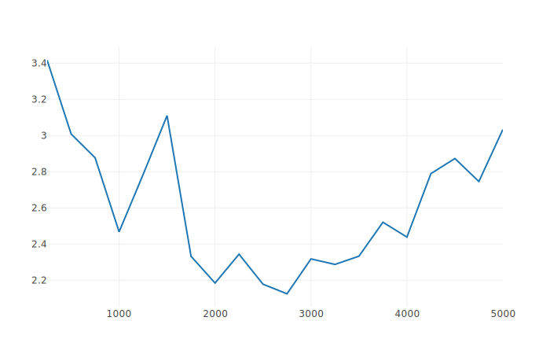
    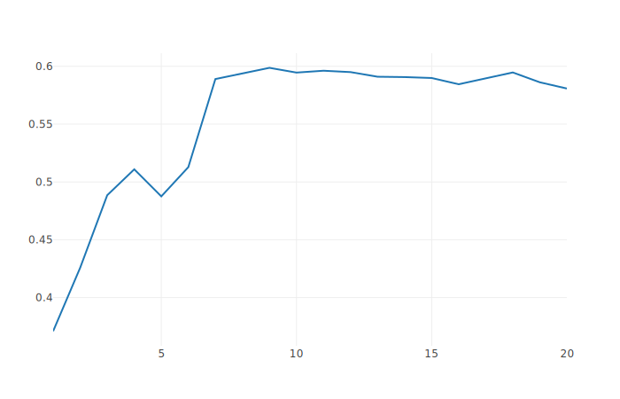<br>
    训练集的loss是在不断下降的，val_loss先减小后增大（左图）（横坐标标错了，实际是epoch，图中标注的是iter），val_acc先上升然后波动（右图）。这是典型的过拟合现象。<br>
    过拟合的处理方法：<br>
    （1）增大数据集的样本数量。<br>
    （2）数据增强，对图像进行丰富的变换或添加噪声。<br>
    （3）正则化。损失函数添加正则化项来惩罚模型参数。<br>
    （4）Dropout或BN层。早期一般在全连接网络中使用Dropout，现在一般在卷积网络中使用BN层。<br>
    （5）减小学习率。<br>
    下面使用各种方法抑制过拟合现象。<br>

    - **正则化-抑制过拟合**<br>
    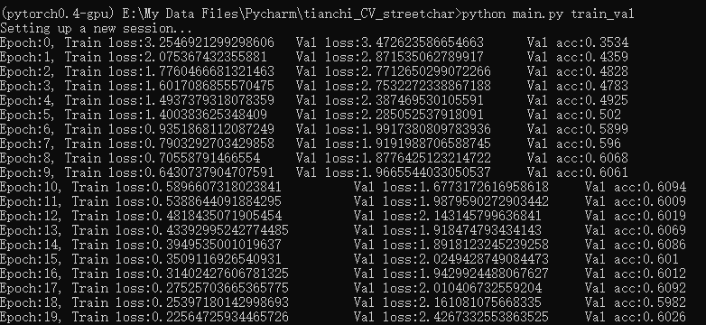<br>
    初始学习率是0.001，训练5个epoch后，学习率降低为原来的10%，为0.0001，然后继续训练15个epoch。依然在第5个epoch后，看到val_loss从2.28降低到1.99，val_acc从0.502大幅提升到0.5899。<br>

    这里Adam优化器加入了weight_decay=0.0005。baseline中的Adam优化器weight_decay默认值是0。<br>
    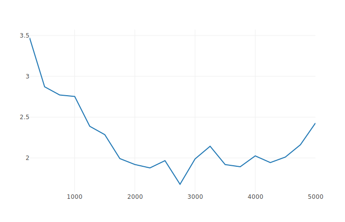
    <br>
    左图是val_loss，右图是val_acc。可以看到有抑制过拟合的效果，且val_acc提高了一个点。没有加正则化项前，val_acc稳定在0.59，现在从第8个epoch到最后一个epoch，val_acc稳定在0.60级别。


- **三阶学习率**<br>
    - **lr = 0.00001**<br>
    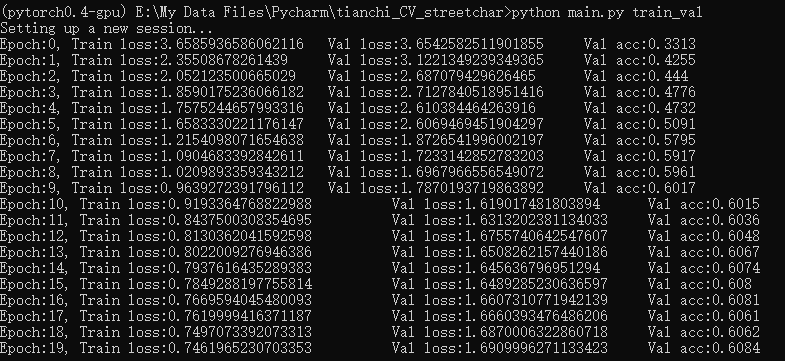<br>
    初始学习率是0.001，在第5个epoch后，学习率降低为前一个的10%，为0.0001，在第10个epoch后，学习率降低为前一个的10%，为0.00001。<br>

    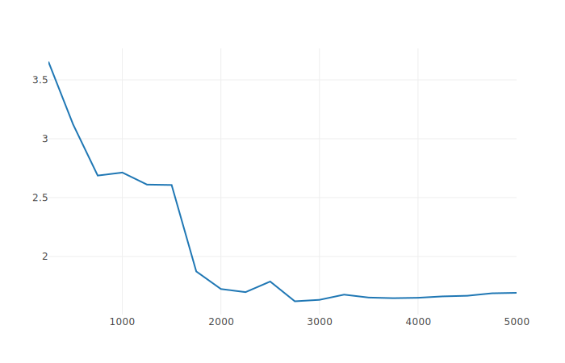
    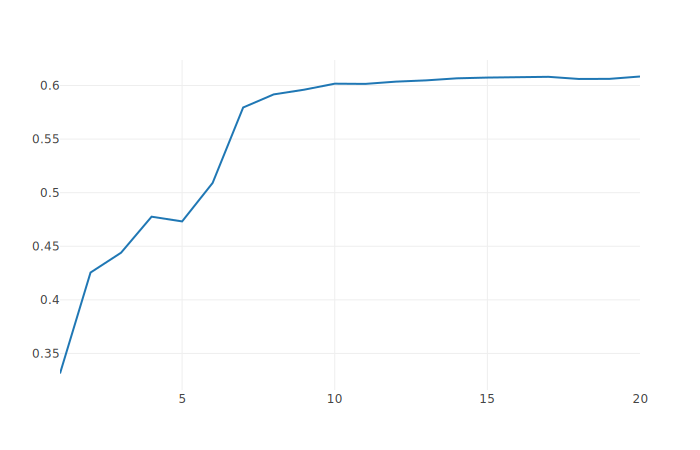<br>
    左图为val_loss，右图为val_acc。可以看到降低学习率，进一步抑制过拟合的效果。但是最后val_acc还是稳定在0.60级别，没有带来验证集精度的提升。<br>
    我还尝试了将三阶段的学习率调节为二阶段学习率的0.2，0.05，0.01，都可以起到抑制过拟合的效果，但是val_acc都是稳定在0.60级别，没有涨点。


- **小结**  
    - 三阶学习率阶梯下降是十分有效的。<br>
    第二阶段的学习率的下降，可以大幅降低val_loss，大幅提高val_acc。第三阶段的学习率的下降，可以稳定val_loss，进一步缓慢的提高一点val_acc。<br>
    在下面的其他模型/其他任务实验中，我们会继续看到使用三阶段学习率的效果很好。<br>
    SSD分支中使用的是SGD优化器，同样设置了2个节点，来降低学习率为前一个学习率的10%，从而构成三阶段学习率阶梯下降。<br>
    一般设置第一阶段的学习率是0.001，第二个阶段是0.0001，第三个阶段是0.00001。
    - Adam优化器很强大。下面实验都是使用Adam优化器+三阶段学习率。<br>
    一个精细调节的SGD优化器在最终的收敛效果上可以略微超过Adam优化器，但是Adam优化器对初始学习率的设置容错度较高，可以自适应调节学习率。Adam优化器比SGD收敛更快。
    - 当训练epoch太多时，容易出现过拟合。<br>
    可以通过数据增强、添加正则化项、Dropout或BN层、减小学习率等来抑制过拟合。<br>
    上面已经看到正则化抑制过拟合的效果，并涨了一个点。 减小学习率也可以一定程度抑制过拟合，但是这个实验没有精度的提高。<br>
    BN层的效果比Dropout好一些，早期的网络使用的是Dropout，ResNet中使用的是BN层，且BN层和Dropout同时使用效果不好。<br>

    下面将从数据增强角度来抑制过拟合，并期望进一步提高val_acc精度。


###  ResNet18 数据增强
baseline中训练集的数据增强是先resize到(64,128)，然后随机裁剪为(60,120)。验证集和测试集没有数据增强，只是resize到(60,120)。<br>
随机裁剪已经是一个十分有效的数据增强手段，下面进行其他的数据增强。<br>

数据读取、显示、变换和处理可以使用的库有matplotlib、OpenCV、skimage和Pytorch中的torchvision等。

- **光学变换**<br>
使用的是torchvision.transform中的ColorJitter()，随机调节图片的亮度、对比度、饱和度和色调。使得模型适应不同的亮度、对比度、饱和度和色调下的图片中的字符识别。

- **噪声**
    - **椒盐噪声**<br>
    我们采用的是skimage库的randon_noise添加椒盐噪声。<br>
    
    <br>
    左图是原图，右图是添加椒盐噪声后的图片。<br>
    <br>
    添加椒盐噪声后，增大了学习难度，最后val_acc在0.56-0.57之间波动。<br>
    
    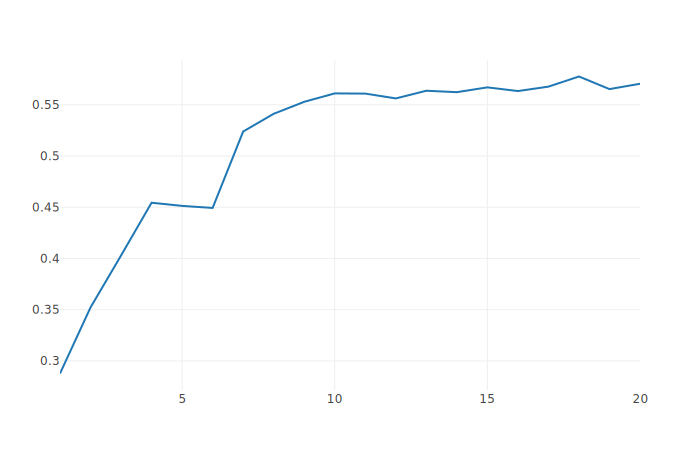<br>
    我们发现添加噪声虽然可以起到数据增强的效果，抑制过拟合。但是同时增大了学习的难度，而且椒盐噪声对于这个字符识别任务是没有太明显的作用。

    - **高斯噪声**<br>
    依然采用skimage库中的random_noise添加高斯噪声。<br>
    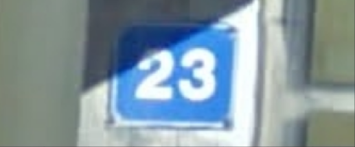
    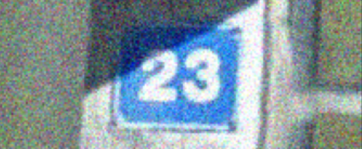<br>
    左图是原图，右图是添加高斯噪声后图片。高斯噪声是对整个图片添加服从高斯分布的噪声，比较均匀，最后的效果看起来比较模糊。椒盐噪声分布不均匀，呈现颗粒状，且强度大。<br>
    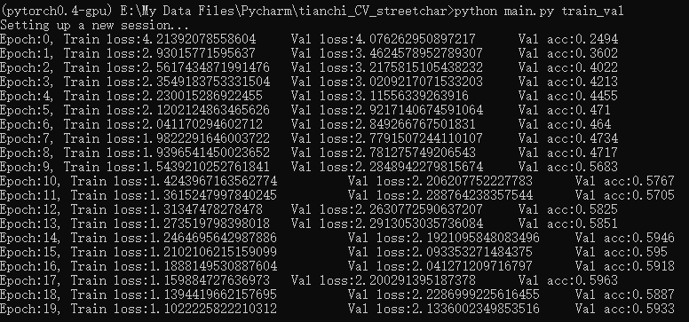<br>
    添加高斯噪声也会增加学习的难度，但是没有椒盐噪声的强度大，最后val_acc稳定在0.59。<br>
    
    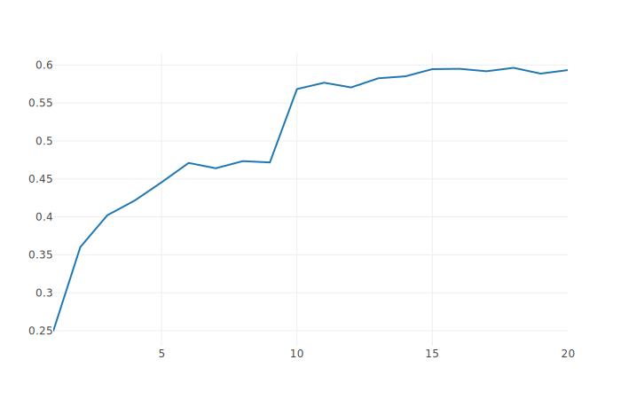<br>
    高斯噪声的val_loss最后的波动幅度比较小，val_acc比椒盐噪声高2个点。我们认为高斯噪声带来的模糊效果是符合这个字符识别数据集的，因为数据集中的部分图片分辨率低，高斯噪声降低分辨率可以使得模型更好的适应低分辨率图片下的字符识别。<br>
    因此，下面没有使用添加噪声，而是直接进行了图像模糊处理。

    - **图像模糊**<br>
    
    <br>
    左图是原图，右图是模糊处理后的图片。<br>
    
    
    <br>
    这是挑选的数据集中的几张分辨率低的图片，对图片进行模糊处理可以达到类似的效果。<br>
    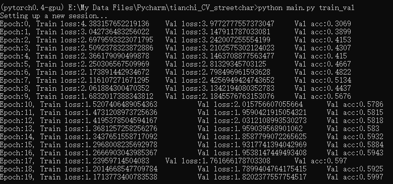<br>
    图像模糊处理会增加学习难度，抑制过拟合，且符合该学习任务的数据集低分辨率特点。<br>
    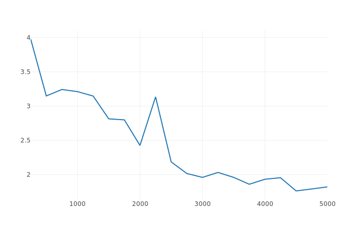
    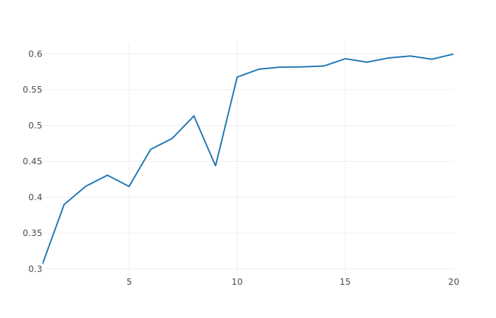<br>
    val_loss最终的波动幅度较小，val_acc稳定在0.59级别。<br>
    通过对比上面三种添加噪声的方法，图像模糊最符合该任务中数据集图片特点，可以使得模型适应低分辨率图片下的字符识别。学习难度和高斯噪声相当，低于椒盐噪声。椒盐噪声可以起到数据增强的效果，但是对该任务没有明显的针对作用。<br>


- **几何变换**
    - **镜像**<br>
    随机左右镜像和上下镜像是十分有效的数据增强手段，例如可以使用torchvision中的RandomHorizontalFlip()等。镜像可以使得模型适应不同位置，不同形态下的物体分类和识别。<br>
    但是，该学习任务是数字字符串识别，**不可以使用镜像处理**。

    - **旋转**<br>
    随机角度旋转也是有效的数据增强手段，且该学习任务的数据集中的部分图片是有一定旋转角度的，因此随机旋转符合该数据集的特点。但是由于是数字识别，**旋转角度不可以太大**，我们使用的是torchvision中的RandomRotation()，限定在-10°~10°之间随机旋转。<br>
    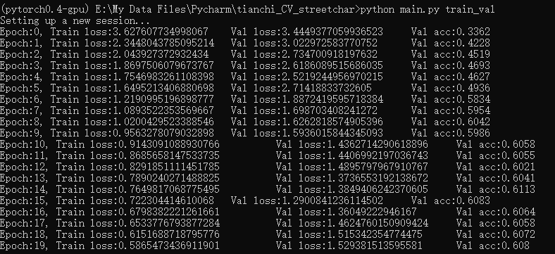<br>
    随机旋转可以提高1个点，最后val_acc稳定在0.60级别。<br>
    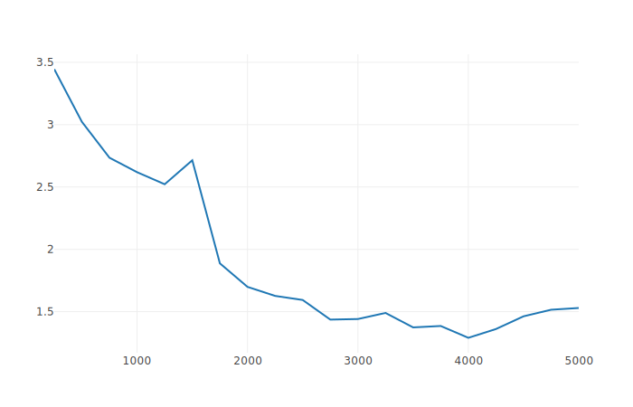
    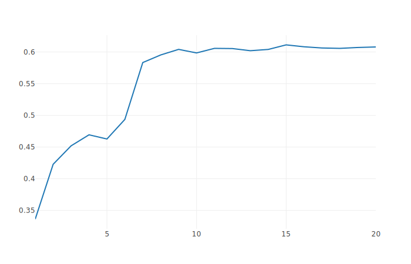<br>
    最后val_loss和val_acc都比较平稳，波动幅度小。

    - **平移**<br>
    位置变换是十分有效的数据增强手段，由于本赛题数字字符识别的特点，无法使用镜像等操作，所以我们使用左右和上下平移来进行位置增强。<br>
    需要说明的是，**本赛题的学习任务对于位置信息很敏感**，尤其是左右位置，因为需要网络学习第1个字符的位置。而数据集图片中的字符位置没有对齐，可能偏左，可能偏右，可能居中。所以通过平移进行位置增强，使得模型适应不同起始位置的字符提取。<br>
    通过随机选择数据集中的样本进行左右和上下偏移，我们发现将图片resize到（64,128），左右偏移量(-35，35)，上下偏移量（-10，10）是合适的。可以起到位置偏移的增强，且不会影响到数字识别。<br>
    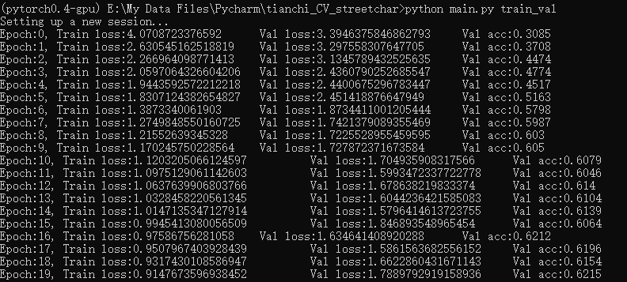<br>
    通过位置偏移，val_acc可以涨1-2个点，0.60->0.61/0.62。最后val_acc在0.61到0.62之间波动。<br>
    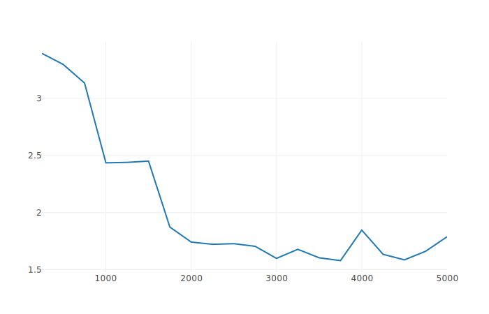
    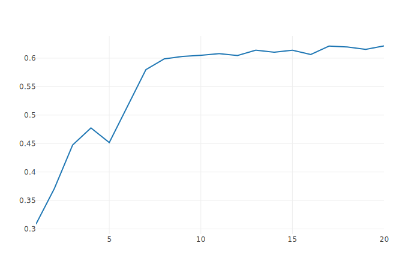<br>
    val_loss最终在1.60-1.70之间波动。

- **数据增强总结**<br>
通过上面单一变量分析和对比实验，我们发现**图像模糊和位置平移十分适合本赛题的学习任务和数据集特点**。<br>
最后，我们把光学变换、图像模糊、随机旋转和随机位置平移综合到一起，进行数据增强。<br>
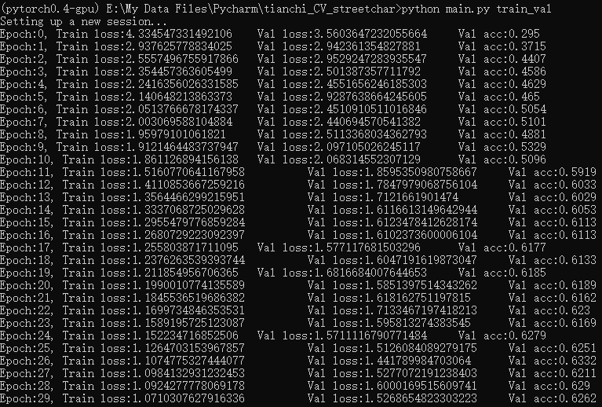<br>
val_acc可以稳定在0.62，甚至达到0.63（epoch26）。<br>
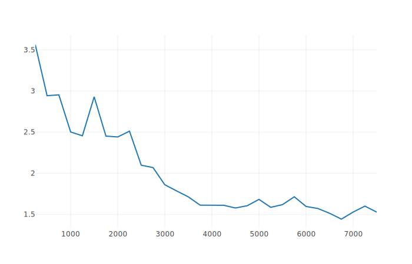
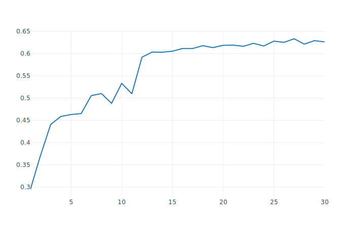<br>
val_loss最终在1.50-1.60之间波动缓慢下降，val_acc在0.62-0.63之间缓慢上升。<br>
val_loss的过拟合通过数据增强降低了，val_acc缓慢上升。可以在上图的基础上继续训练多个epoch，看val_loss是否有明显下降，val_acc是否有明显上升（估计不会了）。由于时间有限，我没有继续往下训练。


###  ResNet34
基于上面ResNet18网络进行各种单一变量实验和综合实验的结果，我们进一步增大模型的复杂度，使用ResNet34的预训练模型，期望获得val_acc精度的提高。
- **数据增强**<br>
数据增强的手段和上面最后一小结使用的数据增强手段相同，随机裁剪、光学变换、图像模糊、随机旋转和随机位置平移。
- **学习率调节**<br>
为了缩短训练时间，我们采用断点续训的方式来调节不同阶段的学习率，即保存每个epoch下的checkpoint，主要是模型的参数和优化器参数，然后选择某个节点的checkpoint继续训练。<br>

    - **一阶学习率**
        - **lr = 0.01**<br>
        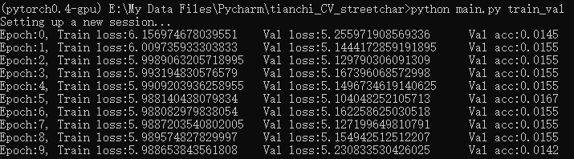<br>
        ResNet34比ResNet18更难训练。<br>
        ResNet18在学习率0.01情况下， Adam用了3个epoch进行学习率自适应调节，在第4个epoch后val_acc从0.1开始快速上升。<br>
        ResNet34在初始学习率为0.01的情况下，进行了10个epoch的训练，都没有将val_loss降低（还是5.1-5.2级别），没有将val_acc提高（还是0.01级别）。所以0.01的初始学习率对于ResNet34太大了。
        - **lr = 0.001**<br>
        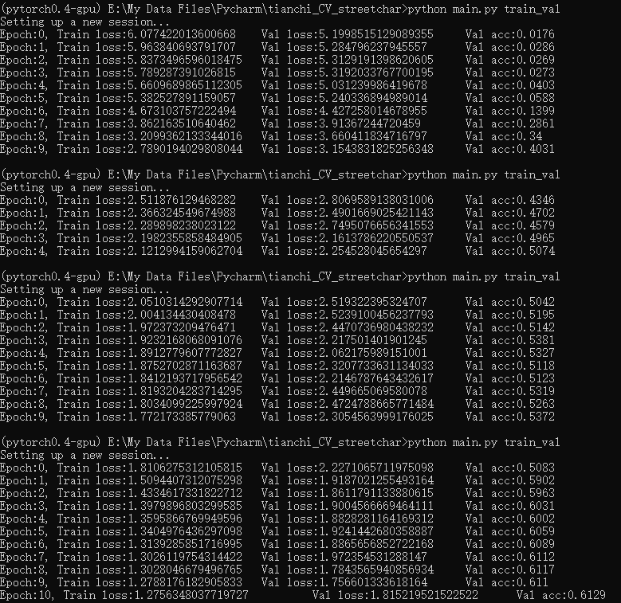<br>
        【第一次实验】我们发现前5个epoch，val_loss没有快速下降，而是在5.1-5.3之间波动，val_acc没有快速上升，而是在0.01-0.05之间缓慢上升。<br>
        **ResNet34比ResNet18更难训练**，在学习率0.001情况下，Adam用了6个epoch进行学习率的自适应调节，在第6个epoch后，val_acc从0.1开始快速上升。<br>

        【第二次实验】我们发现0.001的学习率训练了10个epoch后，val_loss开始快速下降，val_acc快速上升，且没有过拟合趋势，所以继续以0.001的学习率训练了5个epoch。此时，val_loss从3.1下降到了2.5，val_acc从0.4上升到了0.5，提高了10个点。<br>

        【第三次实验】由于上面的5个epoch中，val_loss在下降，val_acc在快速上升，没有过拟合趋势。所以还是以0.001的学习率继续训练10个epoch。发现val_loss从2.5降低到了2.3，val_acc从0.50提高到了0.53。尽管val_acc有提高，但是提高比较缓慢，可以使用0.001的学习率，但是为了加快收敛速度，我们决定使用二阶学习率0.0001。<br>

        【第四次实验-二阶学习率】我们在第二次实验的5个epoch后，改用0.0001的二阶学习率训练了10个epoch。可以发现val_loss从2.2降低到1.9，val_acc从0.50突增到0.59，一个epoch增加了9个点。此后val_loss从1.9缓慢降低到1.7，val_acc从0.59缓慢提高到0.61。<br>

        【第五次实验-三阶学习率】然后改用0.00001的三阶学习率继续训练了20个epoch。<br>
        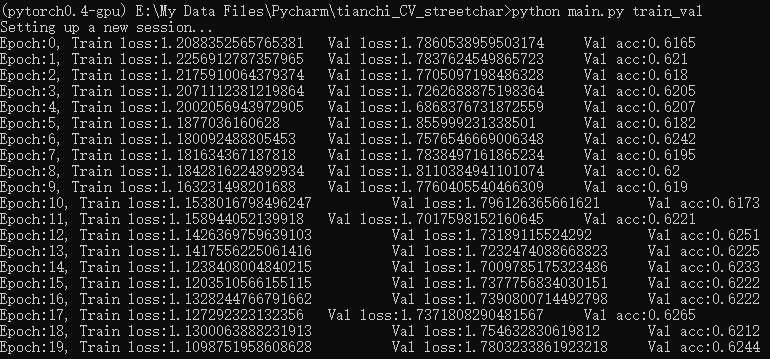<br>
        val_loss在1.7附近波动，val_acc从0.61提高到0.62，提升了1个点。

- **总结**<br>
我们发现更换了更复杂的模型，训练更难了，但是最后的val_acc没有获得提高，还是0.62级别。<br>
下面决定换其他思路来解决这个赛题。

### 改变学习任务：4字符
baseline固定的字符长度是5，但是在随机查看训练集图片是，几乎没有发现字符长度是5的样本。我统计了一下训练集中的样本的字符长度，字符长度为1：2：3：4：5：6的样本数量为4636：16262：7813：1280：8：1。所以，我决定把字符长度固定为4。<br>
固定字符长度为5，意味着很多图片都需要学习后2个或后3个字符为X（空，非0-9字符），而这个预测过程是容易出错的。<br>
我们把字符长度固定为4，就是直接预测错误8个5字符样本和1个6字符样本，但是同时由于大多数的1字符、2字符和3字符样本，需要预测的X字符少了很多，所以可以降低后几位预测X字符的错误，预期可以提高val_acc。<br>

- **数据增强**<br>
和上面使用的数据增强手段相同。随机裁剪、光学变换、图像模糊、随机旋转和随机位置平移。

- **学习率调节**<br>
使用的网络是ResNet34。
    - **一阶学习率 lr = 0.001**<br>
    由于上面有ReSNet34训练的经验，所以直接在一阶学习率使用0.001。<br>
    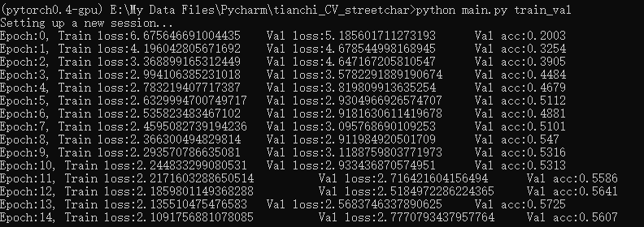<br>
    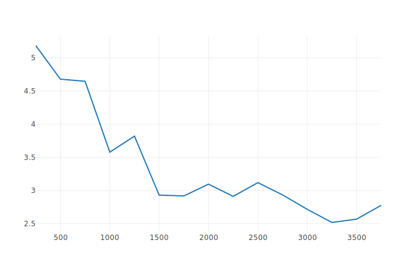
    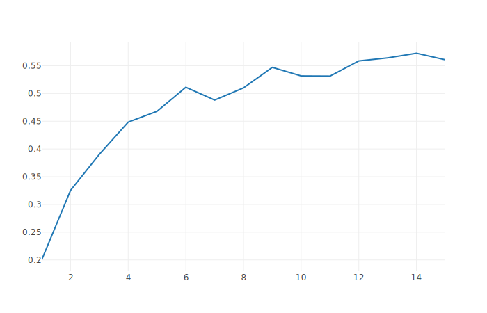<br>
    训练了15个epoch，val_loss从5.1降低到2.5，val_acc从0.2快速上升到0.56。

    - **二阶学习率 lr = 0.001**<br>
    由于一阶学习中val_loss在下降，val_acc在上升，没有看到明显的过拟合现象，所以这里继续使用0.001的学习率训练10个epoch。<br>
    <br>
    此时，val_loss从2.7增加到3.2，val_acc稳定在0.56附近，这是明显的过拟合现象。所以，下面决定在二阶学习率降低为10%，使用0.0001。
    - **二阶学习率 lr = 0.0001**<br>
    使用0.0001学习率，训练了15个epoch。
    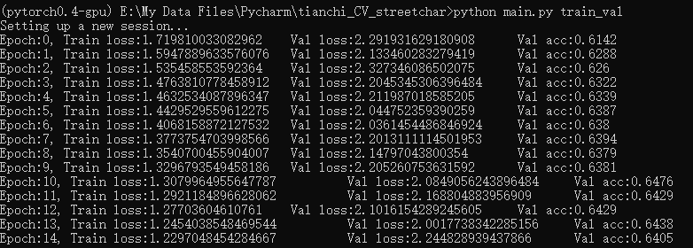<br>
    
    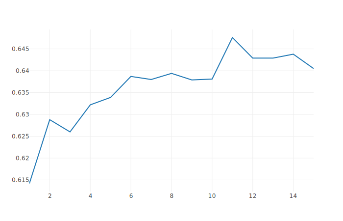
    val_loss从2.3降低到2.0，val_acc从0.56快速上升到0.61（1个epoch，二阶学习率下降的效果），然后从0.61缓慢上升到0.64。
    - **三阶学习率 lr = 0.0001**<br>
    由于二阶段学习中，val_loss在下降，val_acc在上升，没有看到明显的过拟合现象。所以这里仍然使用0.0001的学习率训练了20个epoch。<br>
    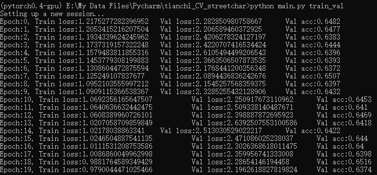<br>
    val_loss在2.2和2.3之间波动，没有明显下降趋势，val_acc在0.64级别波动，没有明显上升趋势。说明此时学习率已经不合适，偏大。
    - **三阶学习率 lr = 0.00001**<br>
    把三阶学习率调节为二阶学习率的10%，为0.00001，训练15个epoch。
    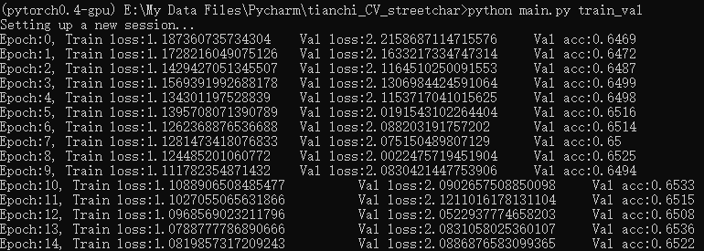<br>
    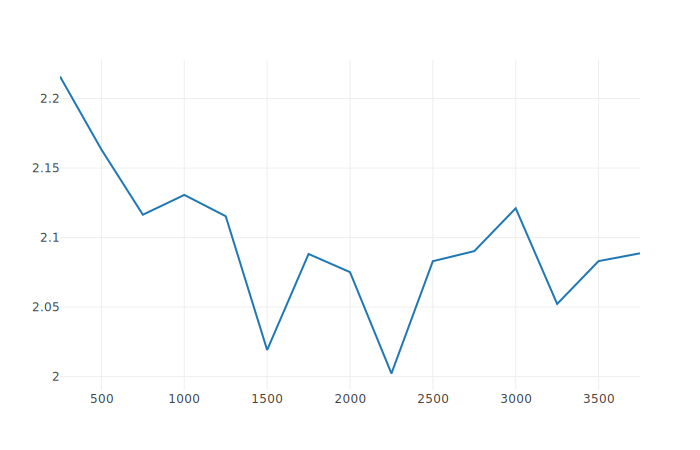
    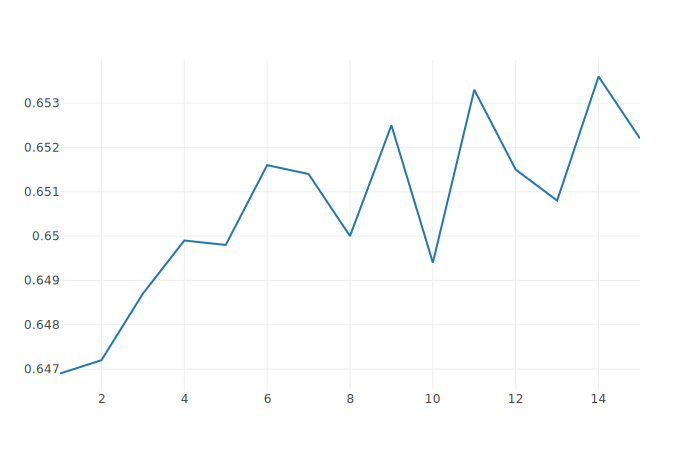<br>
    val_loss从2.2缓慢下降到2.0, val_acc从0.64缓慢上升到0.65，稳定在0.65。说明这个学习率是合适的。

- **总结**<br>
改变学习任务后，val_acc从0.62提高到0.65，提高了3个点。<br>
说明把学习任务改为预测4字符后，学习难度下降了。原来的学习任务是预测5字符，很多2字符、3字符样本需要预测很多后几位的X字符（空字符，非0-9）,这个预测过程容易出错。 现在预测4字符，需要预测的后面的空字符个数少了，从而降低了出错概率，提高了val_acc。


### 改变数据集：样本加权
通过查看提交的测试集预测结果，人工查验了一下测试集前100个样本和前100个预测结果，发现了一个明显的主要出错现象-3字符样本的预测结果容易丢最后一个字符，即把3字符样本的第3位预测为X空字符，从而预测结果是2位，预测错误。<br>
前100个样本中，一共预测错误19个，其中字符预测出错7个，字符丢失出错10个（2字符样本丢失第2位出错2个，3字符样本丢失第3位出错8个）。<br>
下面主要围绕3字符样本丢失第3位的问题进行解决。

- **解决方法**<br>
    - 损失加权。baseline中的4个字符的预测损失直接相加，权重是1：1：1：1，为了提高第1个字符的预测位置准确度和第3个字符的预测准确度，把4个字符的损失加权求和，权重为2：1：2：1。
    - 样本加权。通过上面的统计，看到3字符样本7813，总共的训练集样本数30000。为了增大3字符样本的训练量，在构建train_img_path和train_label_path时，如果样本的字符长度是3，就append两次。从而3字符样本数量增大一倍。
    - 增加预测分支。本来的CNN后连接4个全连接层，分别预测第1、2、3、4个字符的类别。可以增加第5个全连接层，预测每个样本中的字符个数。根据预测的字符个数，提高最终字符串预测结果的准确度。<br>


- **数据增强**<br>
数据增强的手段和上面使用的数据增强手段相同，随机裁剪、光学变换、图像模糊、随机旋转和随机位置平移。<br>
对样本进行加权，使得3字符样本数量增大了一倍。
- **学习率调节**<br>
使用的网络是ResNet34。
    - **一阶学习率 lr = 0.001**<br>
    根据上面的经验，一阶学习率是0.001，训练了15个epoch。<br>
    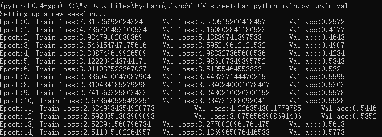<br>
    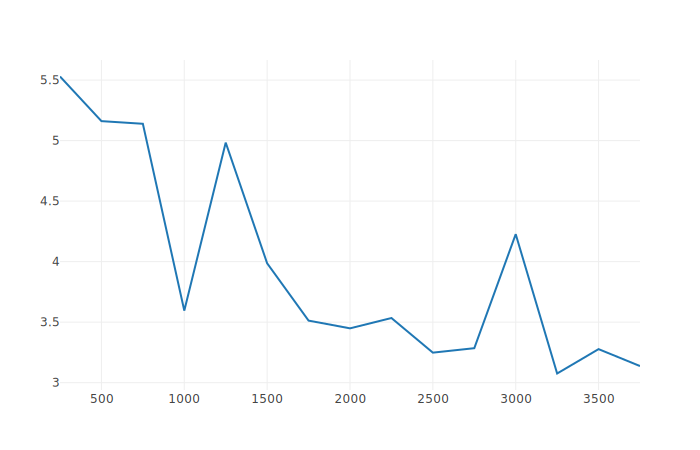
    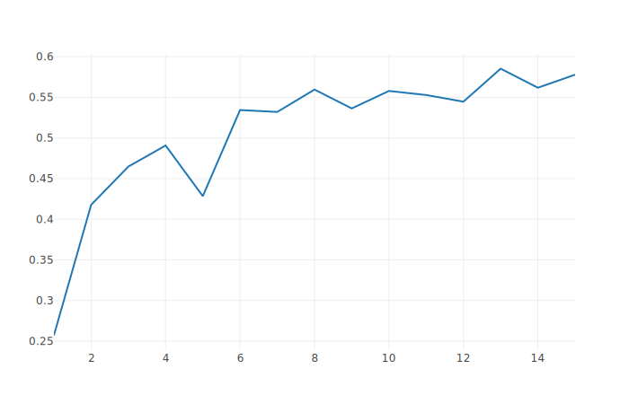<br>
    val_loss从5.5减低到3.1，val_acc从0.25提高到0.57。

    - **二阶学习率 lr = 0.001**<br>
    由于一阶学习中的val_loss仍然在下降，val_acc仍然在上升，所以继续使用0.001的学习率训练10个epoch。<br>
    <br>
    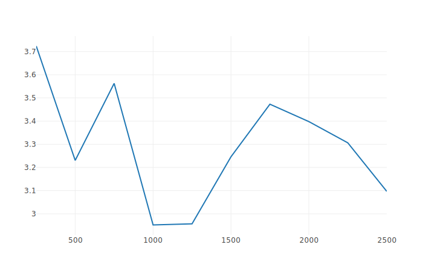
    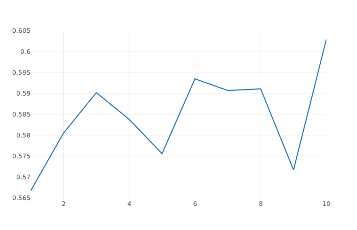<br>
    val_loss从3.5降低到3.0,val_acc从0.56上升到0.60。

    - **三阶梯学习率 lr = 0.001**<br>
    由于二阶学习中的val_loss在下降，val_acc在上述，没有明显的过拟合现象，所以仍然使用0.001的学习率训练10个epoch。<br>
    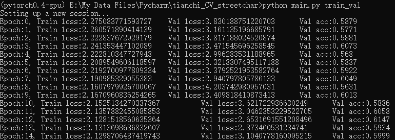<br>
    此时，val_loss在3.0-3.5之间波动，val_acc在0.58-0.60之间波动。由于波动，说明此时学习率已经不合适了，偏大，下面降低学习率进行实验。

    - **三阶学习率 lr = 0.0001**<br>
    下面降低学习率为0.0001的二阶学习率训练了15个epoch。<br>
    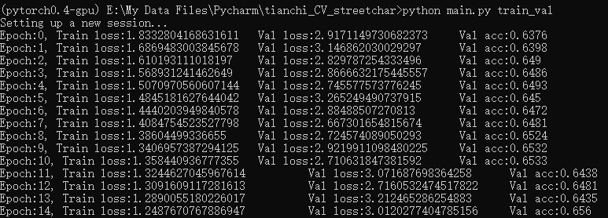<br>
    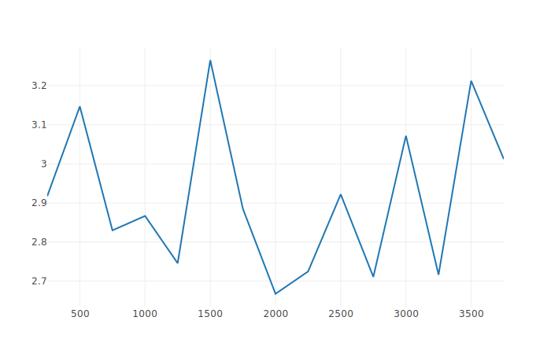
    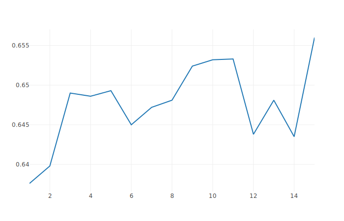<br>
    val_loss在2.7-3.1之间波动，val_acc首先快速上升到0.63（1个epoch突然上升，学习率阶段降低的效果），然后从0.63缓慢上升到0.65。

    - **四阶学习率 lr = 0.0001**<br>
    依然以0.0001的学习率训练了10个epoch。
    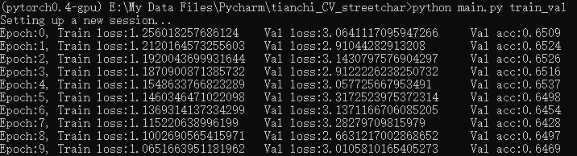<br>
    val_loss在3.0附近波动，val_acc稳定在0.65，没有明显上升趋势。可能是学习率较大，下面降低学习率。

    - **四阶学习率 lr = 0.00001**<br>
    降低学习率，以0.00001的学习率继续训练了20个epoch。<br>
    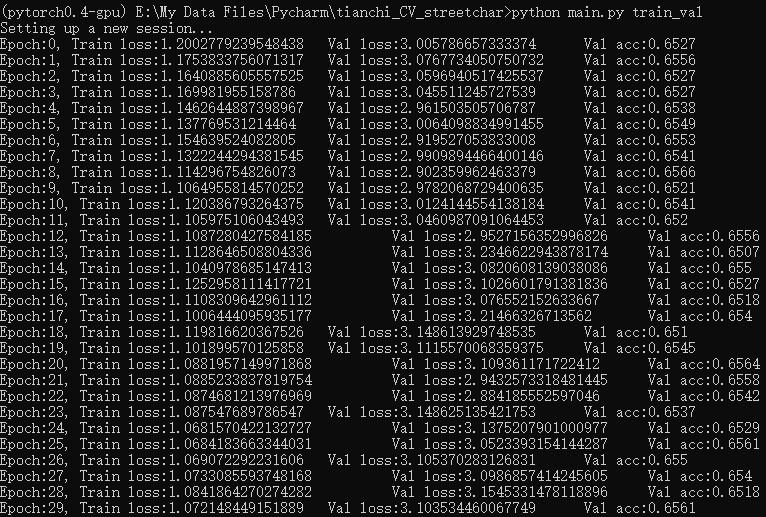<br>
    val_loss在3.0附近波动，val_acc稳定在0.65级别，没有明显上升。

- **总结**<br>
我们发现了出错的一个主要问题，3字符样本丢失第3位。采用的解决方法是损失加权，加大第1个字符和第3个字符的损失权重。样本加权，加大3字符样本数量一倍。<br>
由于时间有限，我还没有尝试第3种解决方法-增加预测分支，预测样本的字符个数。<br>
遗憾的是，最终的val_acc还是在0.65级别，没有提高。已经找到了问题的所在，但是没有解决好。

### 集成学习
- **总结前面**
    - 整个训练过程我们都是使用3阶段下降学习率（每个阶段的学习率是前一个阶段的10%），包括后面的SSD分支中SGD优化器也是使用3阶段下降学习率。
    - ResNet18上通过对数据增强手段的单一变量实现，筛选最合适的数据增强手段。最终利用丰富的数据增强手段，提高3个点0.59->0.62。
    - ResNet34比ResNet18难训练，使用相同的数据增强手段和三阶学习率，最后的val_acc还是0.62级别。
    - 改变学习任务：4字符。可以提高3个点，0.62->0.65。依然使用三阶学习率和相同的数据增强。
    - 改变数据集：样本加权。可以提高3个点，0.62->0.65。这三个点还是改变学习任务中获得的，所以仍然没有解决3字符样本丢失第3个字符的问题。
    - 在掌握了**基本的网络模型，阶段学习率下降，数据增强等常用训练手段**后。提高精度的一个重要角度是**认真分析赛题任务特点，数据集特点，分析测试集主要出错点**。根据本赛题独有的特点，针对性的改进模型，改进训练过程等。<br>
    例如本赛题数字字符串预测，不可镜像，旋转角度小，对位置敏感。本数据集图片分辨率低，统计字符长度，5字符和6字符数据很少，可以忽略。测试集出错的主要原因是3字符样本第3个字符丢失。


- **集成学习**<br>
前面的实验致力于提高单模型的预测精度。下面可以利用集成学习提高总的预测结果的准确率。<br>
集成学习的思路是不推荐的，我们致力于提高单模型的预测精度。因为集成学习的效果是很好的，多个较差的独立基模型集成学习结果，可以有较大提高。<br>
集成学习对于学习本身，赛题本身是没有太大意义的。而且比赛中会限制模型大小和推理时间，如果使用多个模型进行集成，会增大模型大小和推理时间。
    - Bagging<br>
    训练多个不同的模型，每个模型之间的尽量独立，对数据集进行随机采样来训练多个模型。最后通过投票的方法进行模型集成。例如多折交叉验证。<br>
    上面单模型中最好的两个结果是val_acc为0.65，测试集预测后提交score是0.77-0.78左右（因为测试集样本稍微简单一些）。一个最好的结果分别是改变学习任务后训练的结果。另一个最好的结果是改变数据样本分布后训练的结果。这两个模型之间还是有一些差异的，因为改变了数据的样本分布。<br>
    用这两个模型预测结果的平均作为集成学习的结果，提交网站后，score为0.81。可见集成学习效果是很好的。<br>
    我只是用了两个模型进行集成学习，如果集成更多的差异性模型，会获得更好的结果。但是不推荐集成学习，还是致力于提高单模型的精度。

    - 随机森林<br>
    随机森林在Bagging基础上引入随机特征，进一步提高每个基模型之间的独立性。
    - Boosting<br>
    按照一定的顺序先后训练不同的基模型，每个基模型都根据前序模型的错误进行专门训练。Boosting集成学习的效果很好。
    - TTA<br>
    测试集数据增强，就是单个模型对测试集进行多次预测，多个预测结果平均，得到最后的结果。<br>
    我进行了TTA 10次，对比测试集前100个样本和预测结果，发现结果并没有提高。该模型一次预测出错的样本，10次预测结果的平均还是出错。所以一个模型的弱点，在多次预测后平均，这个弱点还是无法弥补的。需要其他不同的模型来弥补。


### SSD 目标检测
